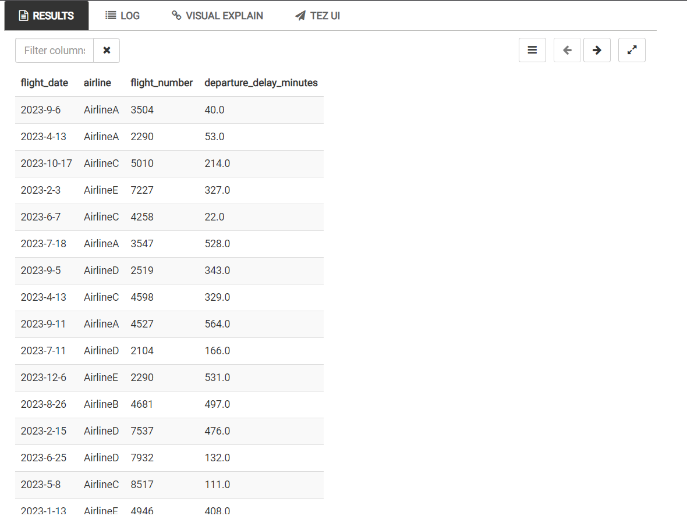
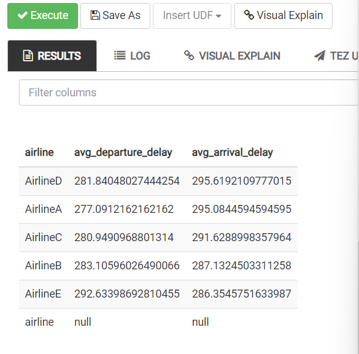
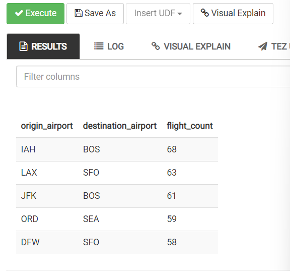
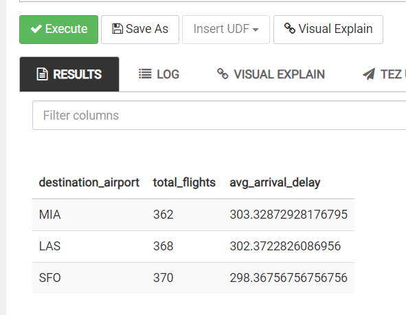
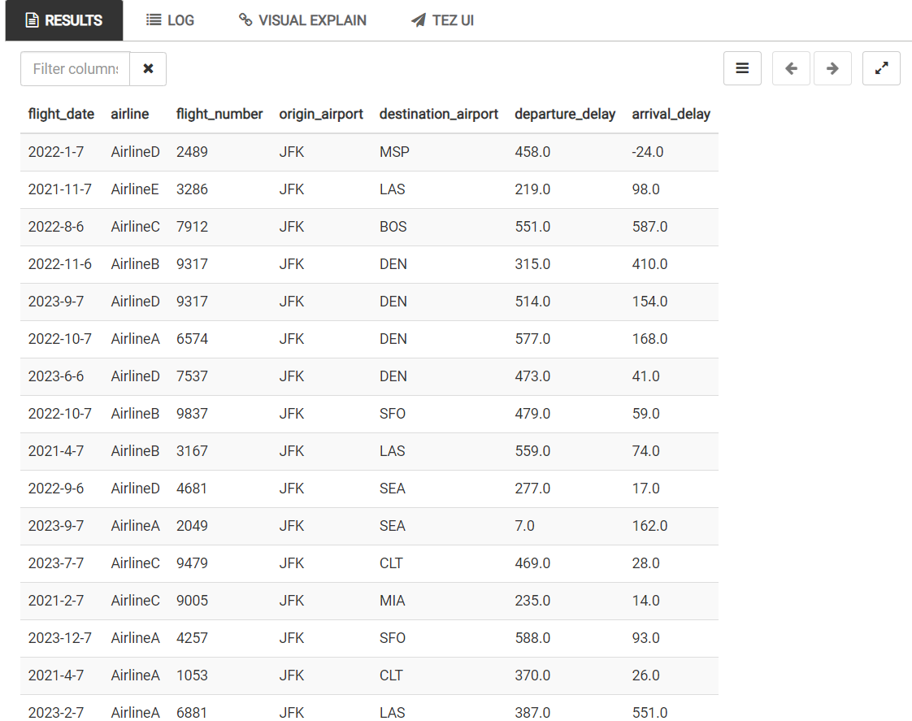
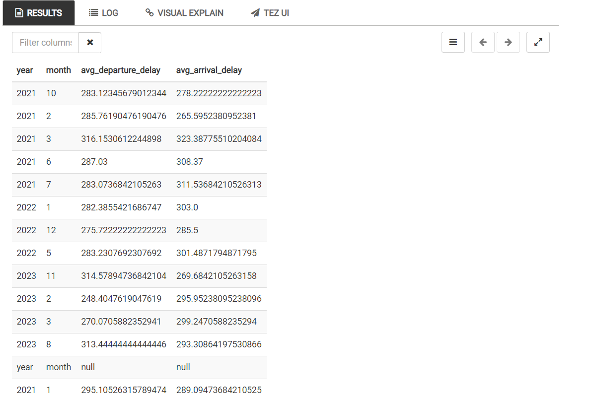
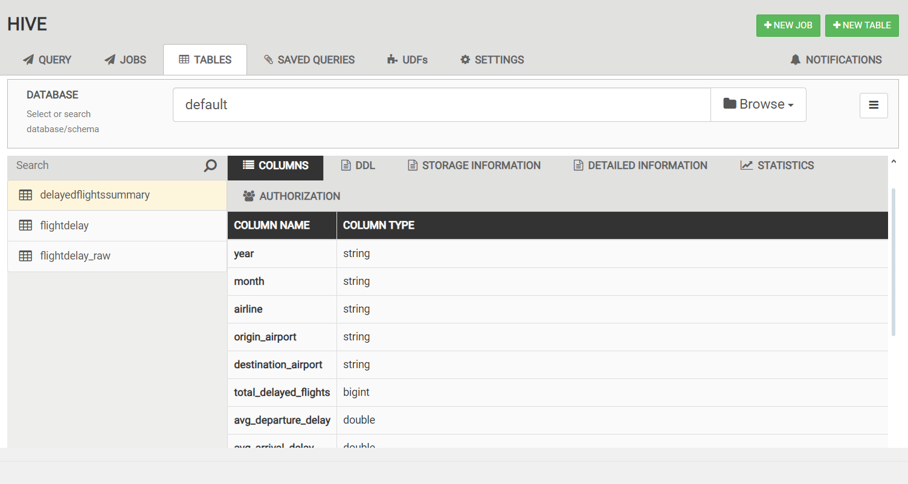
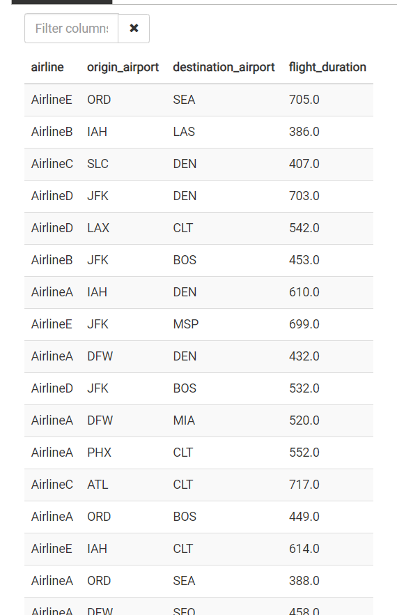
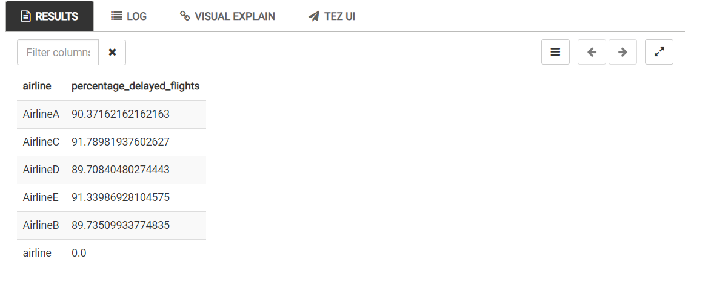
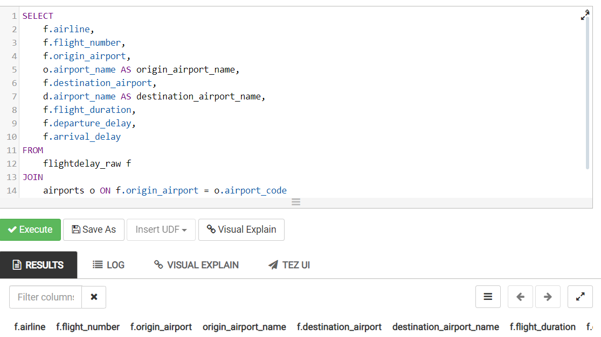

# Practica 10.  
Desde tu cuenta de Azure en el clúster, desde hive usando consultas SQL 
responde las siguientes preguntas. Adjuntar la ‘query’ y la respuesta. 
## Pregunta 1. 
Selecciona todos los registros del año 2023 donde el vuelo fue 
retrasado más de 60 minutos. Muestra las columnas de fecha, aerolínea, 
número de vuelo y el retraso en minutos. 

```bash
SELECT
    CONCAT(year, '-', month, '-', day) AS flight_date,
    airline, 
    flight_number, 
    departure_delay AS departure_delay_minutes
FROM 
    flightdelay_raw
WHERE 
    year = '2023' 
    AND (departure_delay > 60 OR arrival_delay > 60);

```



## Pregunta 2. 
Calcula el promedio de retraso en la llegada y en la salida para 
cada aerolínea. Ordena los resultados en orden descendente por el retraso promedio en la llegada. 

```bash
SELECT
    airline,
    AVG(departure_delay) AS avg_departure_delay,
    AVG(arrival_delay) AS avg_arrival_delay
FROM 
    flightdelay_raw
GROUP BY 
    airline
ORDER BY 
    avg_arrival_delay DESC;

```



## Pregunta 3. 
¿Cuáles son las cinco rutas más comunes (aeropuerto de origen 
y destino) en los datos? Incluye el conteo de vuelos para cada ruta. 

```bash
SELECT
    origin_airport,
    destination_airport,
    COUNT(*) AS flight_count
FROM 
    flightdelay_raw
GROUP BY 
    origin_airport, destination_airport
ORDER BY 
    flight_count DESC
LIMIT 5;

```



## Pregunta 4. 
Encuentra los tres aeropuertos de destino con el mayor 
promedio de retraso en la llegada. Muestra el nombre del aeropuerto, el número total de vuelos y el retraso promedio. 

```bash
SELECT
    destination_airport,
    COUNT(*) AS total_flights,
    AVG(arrival_delay) AS avg_arrival_delay
FROM 
    flightdelay_raw
GROUP BY 
    destination_airport
ORDER BY 
    avg_arrival_delay DESC
LIMIT 3;

```



## Pregunta 5. 
Selecciona todos los vuelos de los fines de semana (sábado y  domingo) con origen en un aeropuerto específico y cuyo retraso en salida o  llegada haya sido superior a 30 minutos. 

```bash
SELECT
    CONCAT(year, '-', month, '-', day) AS flight_date,
    airline,
    flight_number,
    origin_airport,
    destination_airport,
    departure_delay,
    arrival_delay
FROM 
    flightdelay_raw
WHERE 
    origin_airport = 'JFK'
    AND (day = 6 OR day = 7)
    AND (departure_delay > 30 OR arrival_delay > 30);

```



## Pregunta 6. 
Encuentra el promedio de retraso en los vuelos para cada mes y año. Crea una tabla con las columnas de año, mes y promedio de retraso en  minutos. 

```bash
SELECT
    year,
    month,
    AVG(departure_delay) AS avg_departure_delay,
    AVG(arrival_delay) AS avg_arrival_delay
FROM 
    flightdelay_raw
GROUP BY 
    year, month;

```



## Pregunta 7. 
Crea una tabla llamada DelayedFlightsSummary que contenga 
un resumen de los vuelos con retraso superior a 45 minutos en la llegada o  salida. La tabla debe incluir las siguientes columnas: año, mes, aerolínea,  aeropuerto de origen, aeropuerto de destino, número total de vuelos  retrasados y el retraso promedio en minutos para cada combinación. 

```bash
DROP TABLE IF EXISTS DelayedFlightsSummary;

CREATE TABLE DelayedFlightsSummary AS
SELECT
    year,
    month,
    airline,
    origin_airport,
    destination_airport,
    COUNT(*) AS total_delayed_flights,
    AVG(departure_delay) AS avg_departure_delay,
    AVG(arrival_delay) AS avg_arrival_delay
FROM 
    flightdelay_raw
WHERE 
    departure_delay > 45 OR arrival_delay > 45
GROUP BY 
    year, month, airline, origin_airport, destination_airport;

```



## Pregunta 8. 
Selecciona los vuelos con una duración (tiempo de vuelo) 
superior al promedio de duración de todos los vuelos en el mismo año. 
Muestra las columnas de aerolínea, origen, destino y duración del vuelo. 

```bash
SELECT
    airline,
    origin_airport,
    destination_airport,
    flight_duration
FROM 
    flightdelay_raw f
WHERE 
    flight_duration > (
        SELECT AVG(flight_duration)
        FROM flightdelay_raw
        WHERE year = f.year
    );

```



## Pregunta 9. 
Encuentra el porcentaje de vuelos de cada aerolínea que han 
tenido un retraso en la llegada superior a 30 minutos. 

```bash
SELECT
    airline,
    (COUNT(CASE WHEN arrival_delay > 30 THEN 1 END) / COUNT(*)) * 100 AS percentage_delayed_flights
FROM 
    flightdelay_raw
GROUP BY 
    airline;

```



## Pregunta 10. 
Si tuvieras una tabla adicional de aeropuertos con columnas 
como airport_code y airport_name, escribe una consulta para unir esta tabla con los datos de vuelos y obtener el nombre del aeropuerto de origen y de destino en cada vuelo.

```bash
SELECT
    f.airline,
    f.flight_number,
    f.origin_airport,
    o.airport_name AS origin_airport_name,
    f.destination_airport,
    d.airport_name AS destination_airport_name,
    f.flight_duration,
    f.departure_delay,
    f.arrival_delay
FROM 
    flightdelay_raw f
JOIN 
    airports o ON f.origin_airport = o.airport_code
JOIN 
    airports d ON f.destination_airport = d.airport_code;

```


